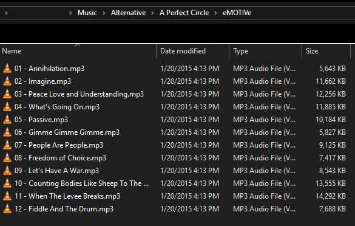
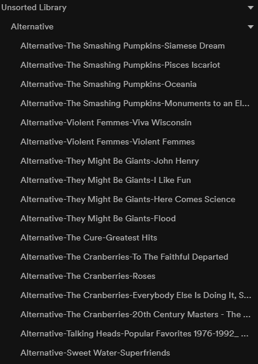

# Spotify Playlist Import

A half-assed application to convert a list of local sorted files in to Spotify playlists.

## Why?

For a few decades I've had all the music that I've bought ripped onto a hard drive, which has been my primary source of
music for that entire time.  Recently we got Spotify, which to me is nice in theory but lacking in execution.  One of my
complaints is that you can't seem to get just the album versions of songs; most of the albums on Spotify are "deluxe"
with a bunch of live songs, demos, etc. afterwards.  99% of the time I don't want to listen to this stuff, I just want
to queue up a bunch of albums and listen - like I did with my local folder of music.  

Of course you can add individual albums to a playlist pretty quickly in Spotify, but this adds all those extra tracks -
which you then have to delete one by one from the playlist.  This is not pleasant.  So I wrote this tool over the
course of a few hours to generate playlists based off of my local files that I can (sort of) quickly combine into
playlists as I want.  I wasn't expecting to get 100% accuracy, but anything close was acceptable to me.  I can clean up the
playlists over time as needed.

The biggest inconvenience to this whole thing is that there isn't an API for creating folders to store playlists in; you
can only do this through the clients.  Why I don't know.  So what I end up with is a bunch of playlists in the root
folder that need to be sorted by hand.  Again, this can be cleaned up over time.

The tools shown here read and write CSV files.  The idea was to make it easy to adjust the data used to generate
playlists as needed.  I also didn't want to spend forever on this, so the code quality is... questionable.  It did work
though: out of about 16k songs found on my local file system, the tools found about 8k in Spotify, and
generated about a thousand playlists.

## Process

Local files should be in a folder sorted by Genre/Artist/Album.  Files should be labeled as Track-Name.mp3.




1. Clone the repository somewhere.
1. Create a Spotify application as shown
   [here](https://developer.spotify.com/documentation/general/guides/app-settings/#register-your-app).
1. Create a file named `spotify-credentials.json` and include your username, application ID, and a URL that will be
   called during the authentication flow.  It doesn't necessarily have to be a real URL as long as you can copy the code
   in the generated URL (the one shown here should work).
    ```json
    {
        "redirectUri": "https://example.com/callback",
        "username": "abcdefg",
        "clientId": "12345"
    }
    ```
1. Authenticate.  This will print out a URL.  Go to the URL, log in, and give permission to your app to access your
   account.
    ```
    node spotify-import.js auth
    ```
    The authentication will then redirect to the URL specified in your credentials file, but will include a "code"
    parameter in the URL.  Copy this entire code, and paste it into the application.  The application will display an
    access token and a refresh token.  Add these to your `spotify-credentials.json` file.
1. Generate the initial CSV file from your local folder.

    ```
    node spotify-import.js gencsv -d folder -o files.csv
    ```
    Note this command - and all of the following - take a `-l` parameter to set a limit on the number of files or rows
    to process.  This is handy when playing around so you don't accidentally generated a ton of data.
1. Find the Spotify URI for each song.  This just performs a search in Spotify given the artist, album, and song title.
   If any results are found, the first result is set as the Spotify song, and will be used in playlists.
    ```
    node spotify-import.js findsongs -i files.csv -o songs.csv
    ```
    If the output CSV file is given as the input (e.g. `-i songs.csv -o songs2.csv`), only songs that don't currently have a Spotify URI will be checked;
    this way if there are songs that aren't found, you can correct the metadata until they are found.
1. Create playlists.  This will generate playlists out of the songs that have a Spotify URI, one playlist per album.
   The playlists will be named like "genre-artist-album".
    ```
    node spotify-import.js createplaylists -i songs.csv -o playlists.csv
    ```
1. Upload playlists.  This actually creates the playlists in Spotify.
    ```
    node spotify-import.js uploadplaylists -i playlists.csv -o playlists2.csv
    ```
At this point I had about a thousand playlists generated, which I then sorted by hand in to folders by genre.  This
   didn't take as long as it sounds like it would.  But it would be nice if Spotify had better support for managing
   large amount of playlists (e.g. multiple select).



And that's that - now I can clean up the playlists over time and eventually get to something that works better for me.